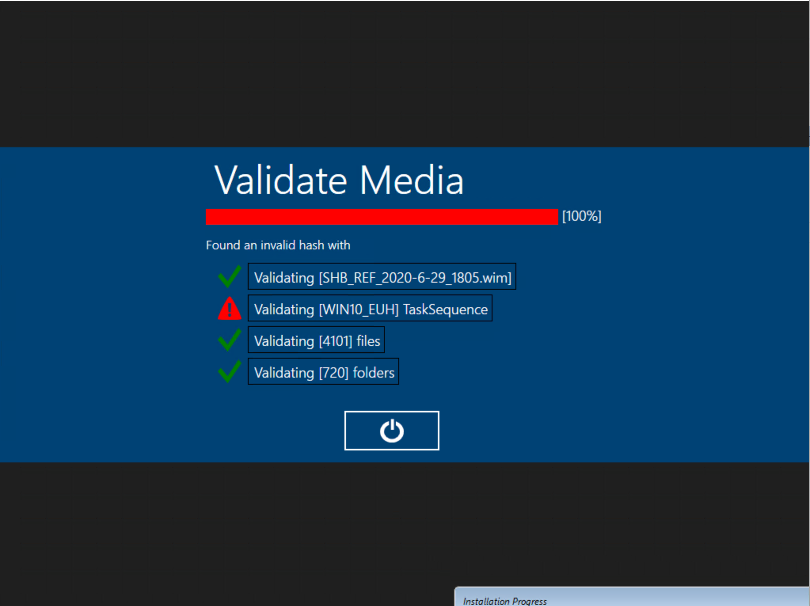
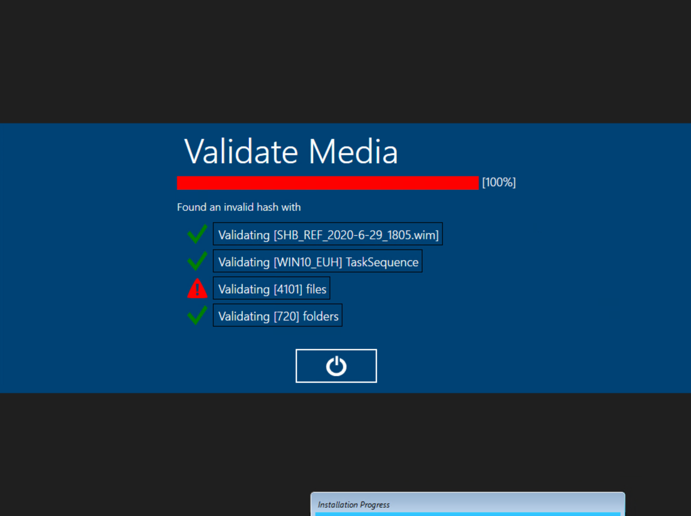
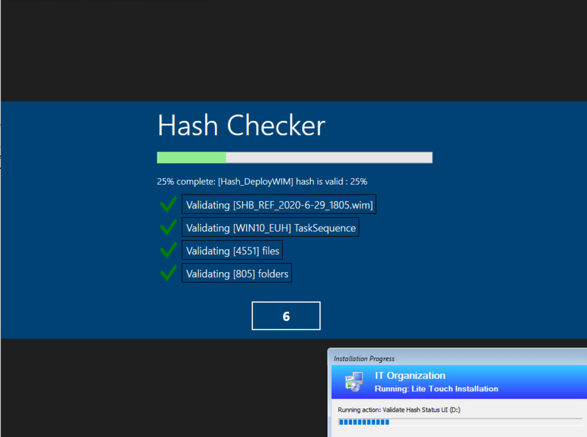

# Hash checking steps

## Steps to check uploaded and downloaded ISO

### Collect hash from each zip file (Before Upload)

```powershell
Set-Location "C:\Users\ritracyi\Downloads\ISOs"
```

```powershell
Get-ChildItem ".\" -Filter "*.zip*" | Get-FileHash | Export-Clixml .\UploadedZipFileHash.xml
```

### Collect hash from each zip file (After Download)

```powershell
Get-ChildItem ".\" -Filter "*.zip*" | Get-FileHash | Export-Clixml .\DownloadedZipFileHash.xml
```

### Compare hashes against upload and download

```powershell
Compare-Object (Import-Clixml .\UploadedZipFileHash.xml) (Import-Clixml .\DownloadedZipFileHash.xml -OutVariable 'downloads') -Property Hash -OutVariable 'NotEqual'
```

If nothing is displayed, the hashes are valid. Continue to build media.
If a hash comparison comes back, there is a file that is not valid and must be re-downloaded and checked again. To find the invalid file run:


### Retrieve invalid file name

```powershell
Split-Path ($downloads | Where {$_.Hash -in $NotEqual.hash}).Path -Leaf
```

## Steps to build OEM Media

### Update MEDIA (intial/update)

 1. Make updates to the OEM items if needed.
 2. Run Update content on Media. This will build the initial or update content folder based on Deploymentshare used to build the media.
WARNING: This may generate an ISO, but do not use this just yet

### Add hash to customsettings.ini

NOTE Properties being added to the ini are:

```ini
Hash_DeployFiles=<hash>
Hash_DeployFolders=<hash>
Hash_DeployTS=<hash>
Hash_DeployWIM=<hash>
```

## Store Hash Script

### Command _before_ Update Content

```powershell
 .\LTIHashStoreUI.ps1 -WorkingPath "C:\DeployOEM\Content\Deploy" -StoreType StoreHash -TaskSequenceID WIN10_DEP
```

## Check Hash Script

### Command _before_ OEM copy (OEM Tasksequence)

```powershell
.\LTIHashCheckUI.ps1 -WorkingPath %DeployDrive%\Deploy -Title 'Validate Media' -CompareType StoredHash -TaskSequenceID WIN10_DEP -ShowStatusUI
```

### Command _after_ OEM copy (OEM Tasksequence)

```powershell
.\LTIHashCheckUI.ps1 -WorkingPath %OSDisk%\Deploy -Title 'Validate Transfer' -CompareType StoredHash -TaskSequenceID WIN10_DEP -ShowStatusUI
```

### Command before EUH UI (EUH Tasksequence)

```powershell
.\LTIHashCheckUI.ps1 -WorkingPath %DeployDrive% -Title 'Validate Content' -CompareType StoredHash -TaskSequenceID %TaskSequenceID% -ShowStatusUI
```


## Screenshots






